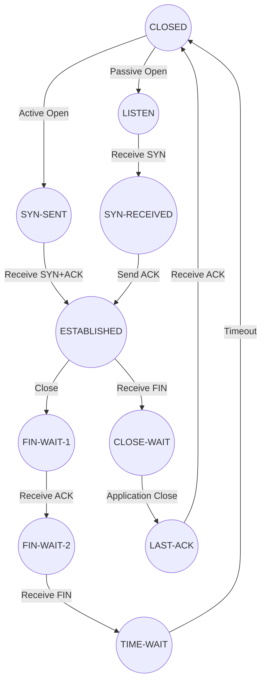

# TCP-IP-in-C

**TCP-IP-in-C** is a custom implementation of a TCP/IP stack written entirely in C. It is designed to deepen your understanding of network protocols by building the core functionalities from scratch. This project focuses on critical aspects of TCP, including header parsing, the connection state machine, congestion control mechanisms, and the retransmission timeout strategy.

## Features

- **TCP Header Parsing**  
  Efficiently parses TCP headers to extract and interpret vital information from network packets.

- **State Machine Implementation**  
  Manages TCP connection states such as `LISTEN`, `SYN-SENT`, `ESTABLISHED`, `FIN-WAIT`, and others according to the TCP state transition diagram.

- **Congestion Control**  
  Implements algorithms to dynamically adjust the transmission rate based on network congestion.

- **Retransmission Timeout**  
  Dynamically calculates and manages retransmission timeouts to ensure reliable data delivery.

The TCP connection state machine is a central component in ensuring a reliable and orderly exchange of data. This implementation follows the principles set out in [RFC 793](https://datatracker.ietf.org/doc/html/rfc793), while incorporating improvements from later updates.

### Key TCP States

| **State**       | **Description**                                                                                                                                                         |
|-----------------|-------------------------------------------------------------------------------------------------------------------------------------------------------------------------|
| **CLOSED**      | - The initial state where no connection exists. - No data can be transmitted or received.                                                                            |
| **LISTEN**      | - The server waits for an incoming connection request (`SYN`). - On receiving a `SYN`, transitions to `SYN-RECEIVED`.                                                |
| **SYN-SENT**    | - The client, having sent a `SYN`, awaits a `SYN-ACK` from the server. - Critical for initiating a connection.                                                       |
| **SYN-RECEIVED**| - After a server receives a `SYN`, it responds with a `SYN-ACK` and transitions to this state. - Awaits the final `ACK` from the client to move to `ESTABLISHED`.     |
| **ESTABLISHED** | - Indicates that the connection is fully open. - Both parties can send and receive data.                                                                             |
| **FIN-WAIT-1**  | - Initiated when a connection shutdown begins. - The endpoint sends a `FIN` and waits for an acknowledgment.                                                         |
| **FIN-WAIT-2**  | - The endpoint moves here after receiving an `ACK` for its `FIN`. - Awaits a `FIN` from the remote side.                                                              |
| **CLOSE-WAIT**  | - Occurs when an endpoint receives a `FIN` while in `ESTABLISHED`. - The local side can still send remaining data before closing.                                    |
| **LAST-ACK**    | - The endpoint that initiated closure waits for an `ACK` of its `FIN`. - Once the `ACK` is received, the connection can be fully terminated.                         |
| **TIME-WAIT**   | - After both sides have closed, the connection enters `TIME-WAIT`. - Ensures all packets are flushed from the network. - Lasts for a duration of `2 * MSL`.       |

### Simplified State Diagram

Below is a diagram representing a simplified version of the TCP connection state machine.

